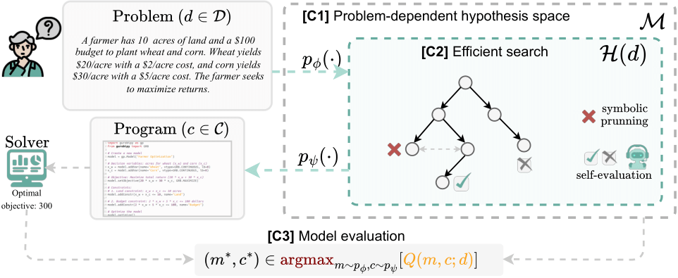

# Autoformulation of Mathematical Optimization Models Using LLMs

This repository contains the code of the paper

[Autoformulation of Mathematical Optimization Models Using LLMs](https://arxiv.org/pdf/2411.01679) published at ICML 2025



## Overview

The repository implements the **Autoformulation of mathematical to** formulate step by step. It includes scripts for two primary experimental tasks:

- **MCTS**: Model formulating step by step mathematical optimization models. Including prunning, ranking self-evaluation, etc.
- **DFS**: A way to construct a dense tree for ablation studies.


### API keys

For OpenAI models, place your key in `utils.py`.

## Running experiments

### NL4OPT

Example of running the whole dataset NL4OPT.

```bash
sh run_all_NLP
```

The code is still not fully clean yet. However, all the components are here.

## Citation

```bibtex
@inproceedings{astorgaautoformulation,
  title={Autoformulation of Mathematical Optimization Models Using LLMs},
  author={Astorga, Nicol{\'a}s and Liu, Tennison and Xiao, Yuanzhang and van der Schaar, Mihaela},
  booktitle={Forty-second International Conference on Machine Learning}
}
```

